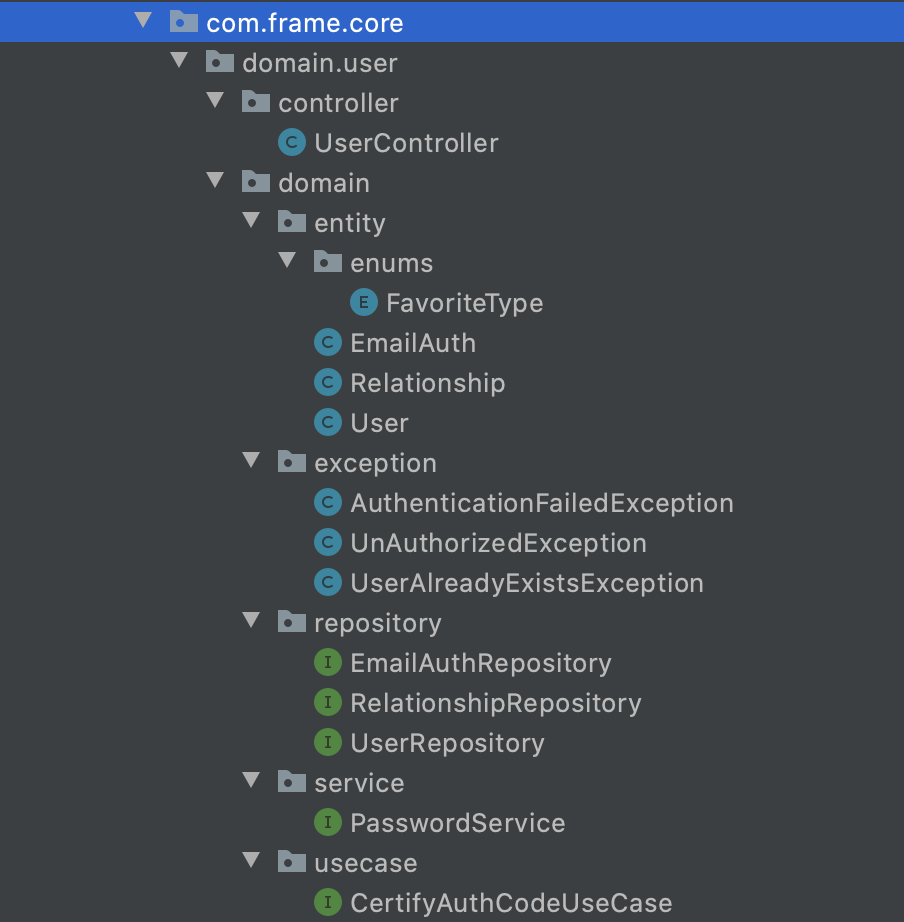
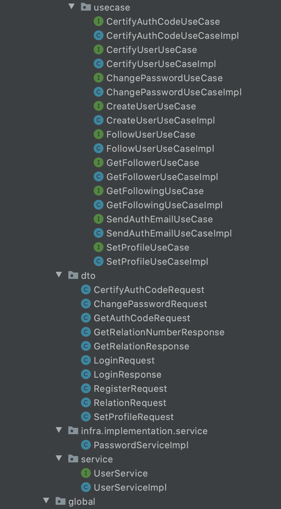
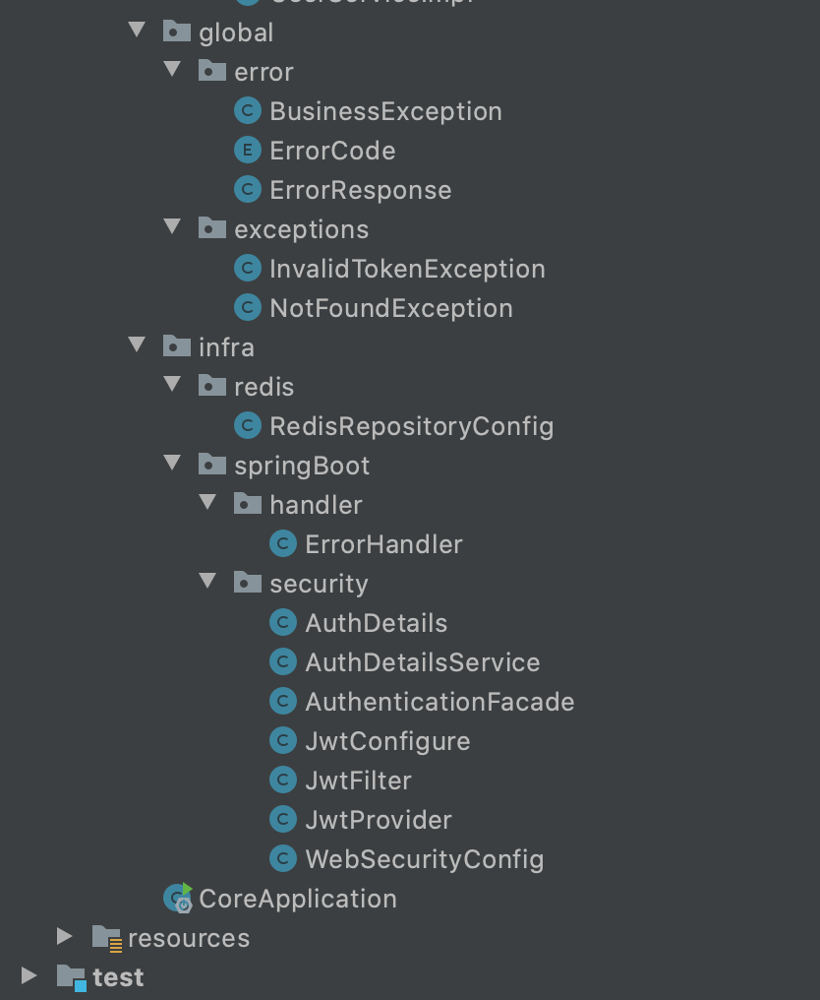

# 민기구조이해하기

## domain

- DDD 상 도메인, 서비스의 큰 개념으로 나뉘는 것들

##### controller

- 요청 컨트롤러

##### domain

- 클린아키텍쳐 상 도메인, 데이터베이스로 치면 테이블 하나

###### Entity

- 엔티티,

###### Exception

- 예외

###### Service

- 서비스

##### UseCase

- 유즈케이스
- 시스템의 동작을 사용자의 입장에서 표현한 시나리오

##### dto

- 리스폰스 json 객체
- DTO(Data Transfer Object)는 VO(Value Object)로 바꿔 말할 수 있는데 계층간 데이터 교환을 위한 자바빈즈를 말합니다.

##### infra

- 인프라가 또있네? 뭘까

#### service

- 컨트롤러가 사용하는 서비스

## global

- 글로벌로 쓰이는것

## infra

- 진짜 인프라
